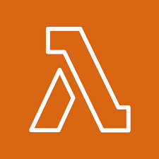
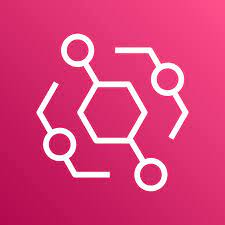

</img>

<h1 style="text-align:center">Welcome Everyone</h1>

My name is Guillaume, I'm a <a href="https://en.wikipedia.org/wiki/Corps_de_l%27armement">IETA</a> of france, judo black belt and information security professional now working at Amazon Web Services in Paris (:fr:)

I'm interested in the many transformations that the cloud is enabling throught the standardization of environnements, increase in security, automation possibilities and cost reductions.

Please find a collection of projects and scripts that I worked on. Don't hesitate to contact me for a virtual cofee.

### Most loved Services

    </img>
    </img>
    </img>
    </img>
    </img>
    </img>

### Pinned projects

### Latest blog
<a href="https://www.linkedin.com/pulse/retour-vers-le-futur-du-cloud-guillaume-neau/">Sometimes in english / Sometimes in French</a>

### Find me on other plateform

